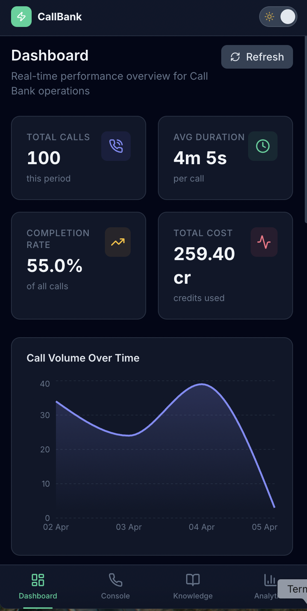
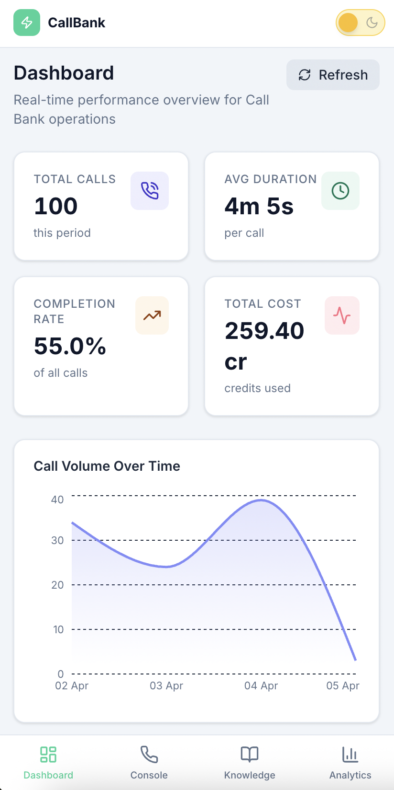
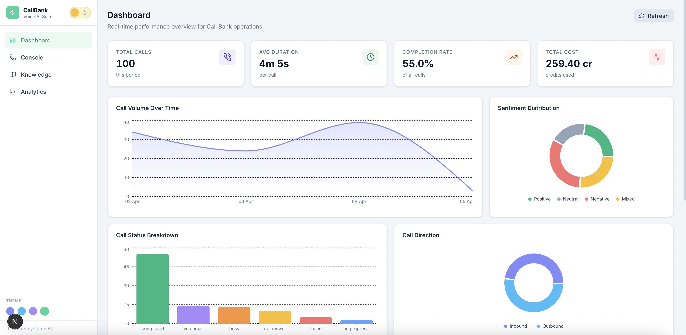
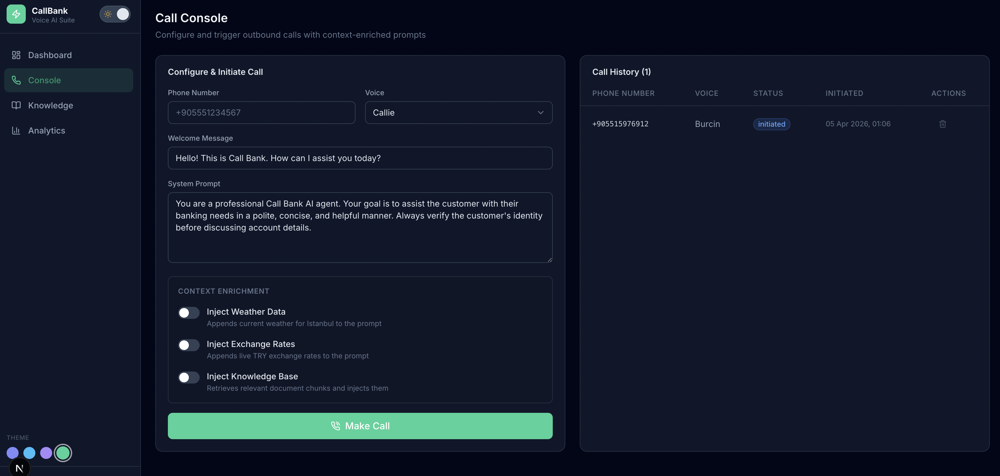
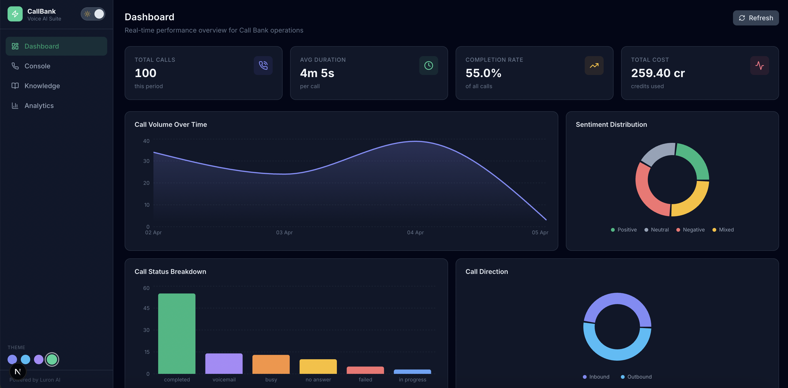
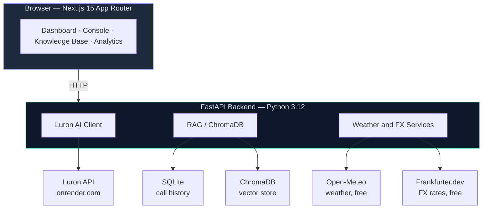

# CallBank — Voice AI Integration Suite

A full-stack Voice AI dashboard for Call Bank, built on top of the Luron AI platform. Real-time call analytics, outbound calling console with context enrichment, and a document-powered knowledge base.

---

## Screenshots

### Mobile — Bottom Tab Navigation

| Dashboard | Call Console |
|:-:|:-:|
|  |  |

### Desktop — Light Mode



### Desktop — Dark Mode

| Light Mode | Dark Mode |
|:-:|:-:|
|  |  |

---

## Architecture



### Stack

| Layer | Technology |
|---|---|
| Frontend | Next.js 15 (App Router, SSR), TypeScript, Tailwind CSS, Recharts |
| Backend | Python 3.12, FastAPI, SQLAlchemy async |
| Database | SQLite via aiosqlite + greenlet |
| Vector DB | ChromaDB with ONNX embeddings (OpenAI optional) |
| External APIs | Open-Meteo (weather), Frankfurter.dev (FX rates) — both free, no key |

---

## Run locally

> **Requirement:** [Docker Desktop](https://www.docker.com/products/docker-desktop/) installed and running.

### 1 — Clone and configure

```bash
git clone https://github.com/yavuzcirit/phone-agent-dashboard.git
cd phone-agent-dashboard

# Create your env file from the example
cp .env.example .env
```

Open `.env` and fill in your `LURON_API_KEY`.

---

### 2 — Start everything with Docker

This single command builds and starts the **backend (FastAPI)**, **frontend (Next.js)**, and the **SQLite database** (auto-created on first boot):

```bash
docker-compose up --build
```

| Service | URL |
|---|---|
| Frontend | http://localhost:3000 |
| Backend API | http://localhost:8000 |
| Swagger / API docs | http://localhost:8000/docs |

---

### 3 — Useful Docker commands

```bash
# Follow live logs from all services
docker-compose logs -f

# Backend logs only
docker-compose logs -f backend

# Stop and remove containers
docker-compose down

# Rebuild after code changes
docker-compose up --build

# Open a shell inside the running backend container
docker-compose exec backend bash
```


## Local debug setup

> **Requirement:** Python 3.12. Python 3.13+ is not yet supported by `pydantic-core`.
> Check with `python3.12 --version`. Install via Homebrew if missing: `brew install python@3.12`

### 1 — Backend

```bash
cd backend

# create virtualenv with Python 3.12 explicitly
python3.12 -m venv .venv
source .venv/bin/activate          # Windows: .venv\Scripts\activate

# install dependencies
pip install -r requirements.txt

# copy environment file
cp ../.env.example .env

# start with auto-reload and debug logging
uvicorn app.main:app \
  --host 0.0.0.0 \
  --port 8000 \
  --reload \
  --log-level debug
```

Verify the backend is running:

```bash
curl http://localhost:8000/health
# → {"status":"ok"}
```

Interactive API explorer: **http://localhost:8000/docs**

---

### 2 — Frontend

Open a second terminal:

```bash
cd frontend

# install dependencies (only needed once)
npm install

# copy environment file
cp .env.local.example .env.local

# start dev server with hot reload
npm run dev
```

Open **http://localhost:3000** — the root redirects to `/dashboard`.

> The frontend reads `NEXT_PUBLIC_API_URL` from `.env.local` for client-side calls
> and `API_URL` for server component fetches. Both default to `http://localhost:8000/api`.

---

## Environment variables

| Variable | Required | Default | Description |
|---|---|---|---|
| `LURON_API_KEY` | Yes | — | Luron AI API key |
| `LURON_BASE_URL` | No | `https://luron-backend.onrender.com/api/v1` | Override for staging |
| `OPENAI_API_KEY` | No | `""` | Enables OpenAI embeddings; falls back to ONNX when empty |
| `LOG_LEVEL` | No | `INFO` | `DEBUG` / `INFO` / `WARNING` |

---

## Debugging

### Smoke-test every API route

```bash
# health
curl http://localhost:8000/health

# mock call data (3 records)
curl "http://localhost:8000/api/mock-data?count=3" | python3 -m json.tool

# call history (persisted in SQLite)
curl http://localhost:8000/api/calls | python3 -m json.tool

# knowledge base documents
curl http://localhost:8000/api/knowledge-base | python3 -m json.tool

# weather integration
curl "http://localhost:8000/api/integrations/weather?city=Istanbul"

# exchange rate integration
curl "http://localhost:8000/api/integrations/exchange-rates?base=TRY"
```

### Inspect the SQLite database

```bash
sqlite3 backend/data/callbank.db

.tables
# call_records   knowledge_documents

SELECT id, phone_number, status, created_at FROM call_records ORDER BY created_at DESC LIMIT 5;
SELECT id, filename, chunk_count, status FROM knowledge_documents;
.quit
```

### Inspect ChromaDB chunks

```bash
cd backend
python3.12 -c "
import chromadb
client = chromadb.PersistentClient('./data/chroma')
col = client.get_collection('knowledge_base')
print('total chunks:', col.count())
print(col.peek())
"
```

### Run a one-off service call

```bash
cd backend
source .venv/bin/activate

python3 -c "
import asyncio
from app.services.weather import fetch_weather_context
from app.services.exchange_rate import fetch_exchange_rate_context

async def main():
    print(await fetch_weather_context('Istanbul'))
    print(await fetch_exchange_rate_context('TRY'))

asyncio.run(main())
"
```

### Frontend server component logs

Server component output (SSR fetches, `console.log` in `async` page functions) appears in the **terminal running `npm run dev`**, not in the browser.

Client component state and events are visible in **browser DevTools → Console** and with the [React DevTools](https://react.dev/learn/react-developer-tools) extension.

### Docker logs

```bash
# follow both services
docker-compose logs -f

# backend only
docker-compose logs -f backend

# open a shell inside the running backend container
docker-compose exec backend bash

# run a one-off command inside the container
docker-compose exec backend python3 -c "
from app.core.config import get_settings
print(get_settings().model_dump())
"
```

---

## Common issues

| Symptom | Cause | Fix |
|---|---|---|
| `pydantic-core` build fails | Python 3.13+ not supported | Use `python3.12 -m venv .venv` |
| `greenlet` not found on startup | Missing SQLAlchemy async driver | `pip install greenlet==3.1.1` |
| Dashboard shows no data | Backend not running | Start backend first on port 8000 |
| Exchange rates return 301 | Frankfurter moved domain | Already fixed — uses `api.frankfurter.dev/v1` |
| `422` on make-call | Phone not E.164 | Use `+` prefix, e.g. `+905551234567` |
| `502` on make-call | Luron API unreachable or wrong key | Check `LURON_API_KEY` in `backend/.env` |
| ChromaDB `Collection not found` | No documents uploaded yet | Upload a file in the Knowledge Base page |
| Frontend `fetch failed` in build | Backend not available at build time | Normal — pages use `dynamic = "force-dynamic"` |

---

## Features

### Dashboard
Server-rendered (force-dynamic). Displays total calls, average duration, completion rate, cost, call volume over time, sentiment distribution, status breakdown, and direction split.

### Call Console
Configure voice, prompt, welcome message, E.164 phone number. Toggle weather data, exchange rates, and knowledge base context injection before making a call. Persisted call history with delete.

### Knowledge Base
Drag-and-drop PDF/DOCX upload. Text is extracted, chunked (512 tokens, 50-token overlap), embedded with ONNX, and stored in ChromaDB. Top-k relevant chunks are injected into the call prompt when the toggle is enabled.

### Analytics
Topics bar chart, outcome pie chart, hourly heatmap, duration histogram, sentiment score trend, tag frequency bar, and per-agent performance table.

### External API enrichment

| Source | Data injected into prompt | Provider |
|---|---|---|
| Weather | Current conditions and temperature | Open-Meteo (free, no key) |
| Exchange Rates | TRY pairs: USD, EUR, GBP, JPY, CHF | Frankfurter.dev (free, no key) |
